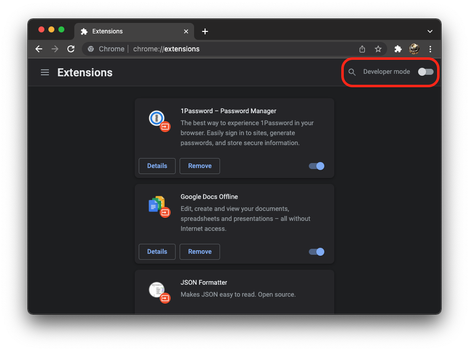
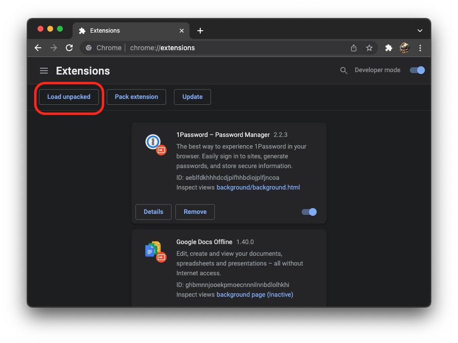
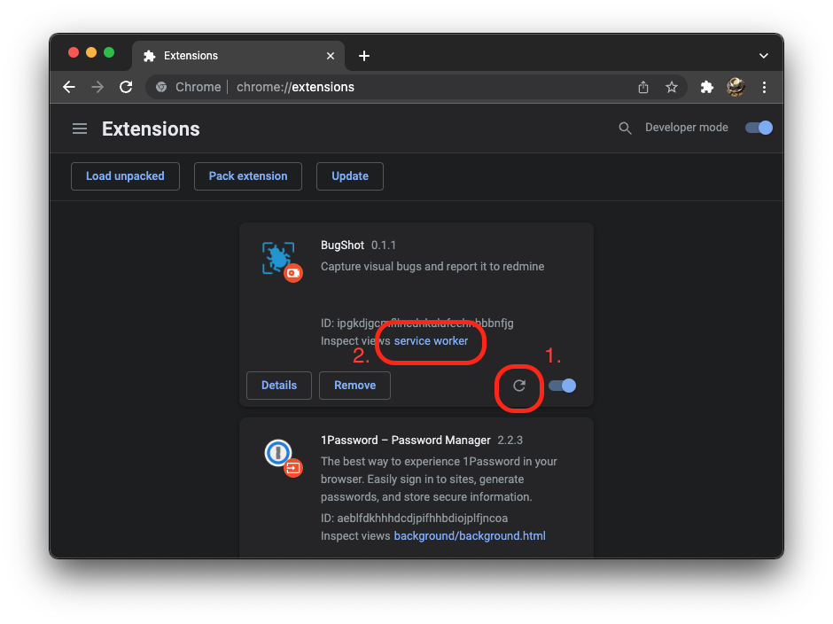

Chrome extension to capture visual bugs and report them to redmine

## Development

```bash
# install dependencies
yarn install
# build extension and start watching for changes
yarn run develop
```

For local development, the extension must be installed in the Chrome browser.
To do this, go to the [chrome://extensions](chrome://extensions/) page and turn on the `Developer mode`. 



Then the extension can be loaded via the "Load Unpacked" button. 



To load the extension select the build folder with the file chooser.

Whenever a change is made to the manifest or background bundle, the extension must be manually reloaded with the reload button (1 in the screenshot below). 
To troubleshoot the service worker, the devtools can be opened with the `service worker` link (2 in the screenshot below).


